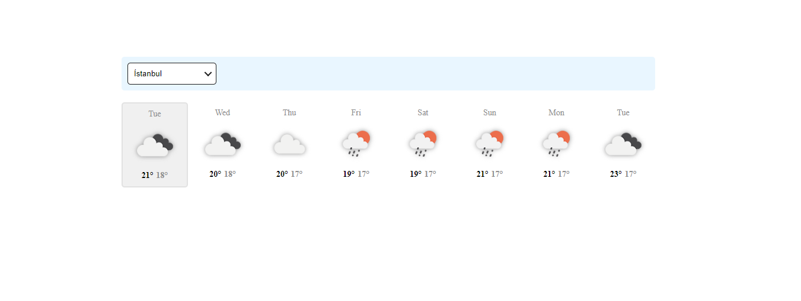

# Weather App

This project made for react.js context api homework what in the patika.dev.
I used openweather api for data. Cities in the dropdown menu are static data, i have get from this repo [this gist](https://gist.github.com/ozdemirburak/4821a26db048cc0972c1beee48a408de) so thanks to him for create this data. My project looks like below.

---

